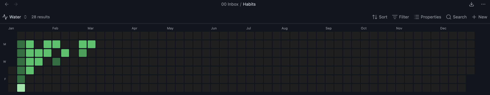
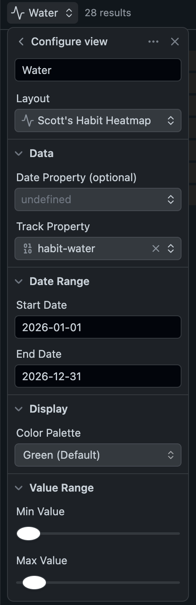

# Habit Tracker Heatmap

A GitHub-style contribution heatmap view for [Obsidian Bases](https://obsidian.md/bases). Visualize any numeric or boolean frontmatter property across your daily notes as a color-coded grid — one column per week.

## Features

- GitHub-style green color scale based on property value
- Supports numeric properties (e.g. `habit-water: 3`) and boolean properties (`habit-vitamins: true`)
- Configurable date range, min/max value scale
- Responsive — cell size adapts to the pane width
- Click any cell to open the corresponding note
- Hover tooltip showing the date and value
- Date parsed from frontmatter property or automatically from the filename (`YYYY-MM-DD` or `MM-DD-YYYY`)




## Requirements

- Obsidian 1.9.0 or later (Bases support required)

## Install

To install via BRAT, add the repo path: https://github.com/scottfwalter/scott-obsidian-habit-tracker

## Usage

1. Create or open a `.base` file in Obsidian
2. Click the view selector and choose **Scott's Habit Heatmap**
3. Configure the view options in the Bases toolbar:

| Option             | Description                                                                                            | Default                         |
| ------------------ | ------------------------------------------------------------------------------------------------------ | ------------------------------- |
| **Track Property** | The frontmatter field to visualize (e.g. `note.habit-water`). Supports numeric and boolean values.     | _(none)_                        |
| **Date Property**  | Optional frontmatter field containing the note's date. If unset, the date is parsed from the filename. | _(filename)_                    |
| **Start Date**     | Beginning of the date range (`YYYY-MM-DD`).                                                            | January 1 of the current year   |
| **End Date**       | End of the date range (`YYYY-MM-DD`).                                                                  | December 31 of the current year |
| **Color Palette**  | Color scheme for filled cells. Options: `Green`, `Red`, `Blue`, `Orange`, `Purple`.                    | Green                           |
| **Min Value**      | Value at or below which a cell renders as the empty/dark color. Range: 0–100.                          | 1                               |
| **Max Value**      | Value at which a cell reaches full color intensity. Range: 1–100.                                      | 10                              |

### Supported Filename Formats

When no Date Property is configured, the plugin parses the date from the note's filename:

| Format       | Example filename |
| ------------ | ---------------- |
| `YYYY-MM-DD` | `2026-02-24.md`  |
| `MM-DD-YYYY` | `02-24-2026.md`  |

Subfolders are ignored — only the filename matters.

## Contributing

### Key Files

```
habit-tracker-heatmap/
├── src/
│   ├── main.ts              # Plugin entry point — registers the Bases view
│   └── heatmap-view.ts      # All view logic: config, data processing, DOM rendering, interactions
├── scripts/
│   └── release.sh           # Tags the repo and creates a GitHub release with assets attached
├── manifest.json            # Obsidian plugin manifest (id, version, minAppVersion)
├── versions.json            # Maps plugin versions to minimum Obsidian versions
├── esbuild.config.mjs       # Build config (watch + production modes)
├── tsconfig.json
└── main.js                  # Compiled output — this is what Obsidian loads
```

### Building

Install dependencies:

```bash
npm install
```

**Development** (watch mode — rebuilds `main.js` on every save):

```bash
npm run dev
```

**Production build** (type-checks first, then bundles):

```bash
npm run build
```

### Installing into Obsidian

Run:

```bash
npm run install
```

This builds the plugin and copies `main.js` and `manifest.json` into your vault's plugin folder. The default vault location is:

```
$HOME/Obsidian/My Second Brain
```

To use a different vault, set `OBS_VAULT_DIR` before running:

```bash
OBS_VAULT_DIR="/path/to/your/vault" npm run install
```

Then in Obsidian: **Settings → Community Plugins → enable "Scott's Habit Tracker Heatmap"**.

If the plugin was already enabled, toggle it off and back on to pick up the new build.
